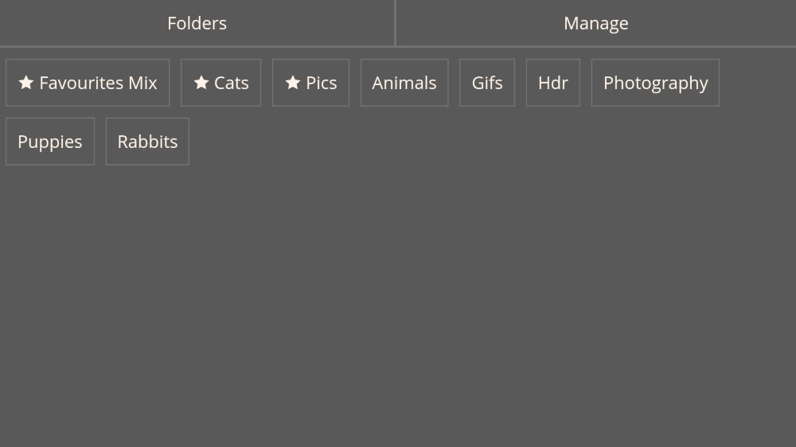
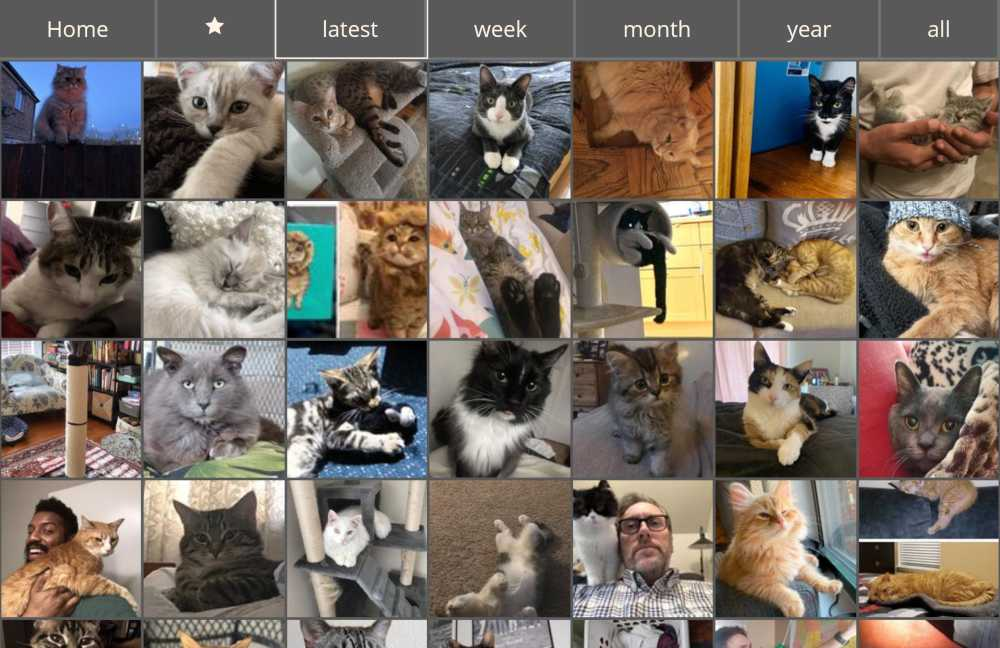
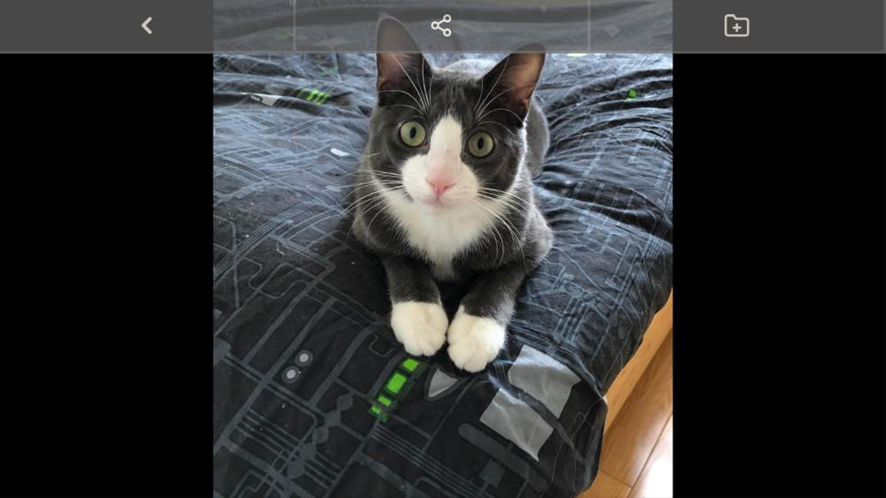
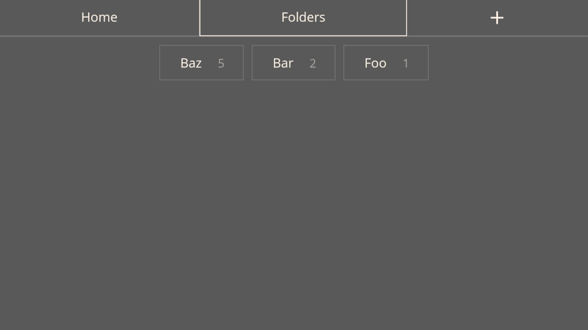
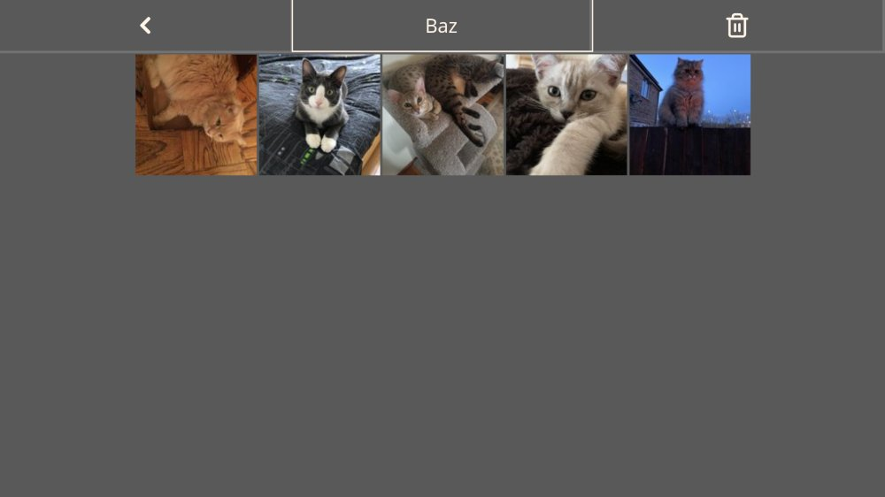
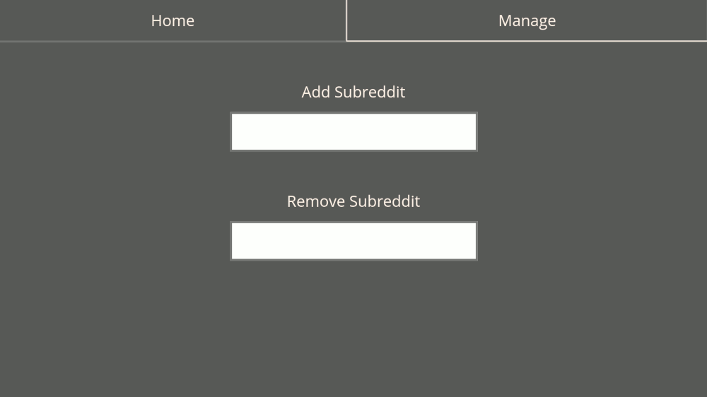

#### Reddit Pictures Organiser

Reddit Pictures Organiser is a mobile-first Reddit image organiser. 

##### How To Use:

1. Add a subreddit name to the manage page
2. Go back to the home page and click on the subreddit
3. To add an image to a folder, tap the image and click on the folder icon
4. Your image is now saved to a folder. You can access your folders from the home page
5. To remove the url bar, install/save Reddit Pictures Organiser it to your homescreen

##### Screenshots:

Home Page:

Subreddit Thumbnail Page:

Image View:

Folders Page:

Folder Page:

Manage Page:

